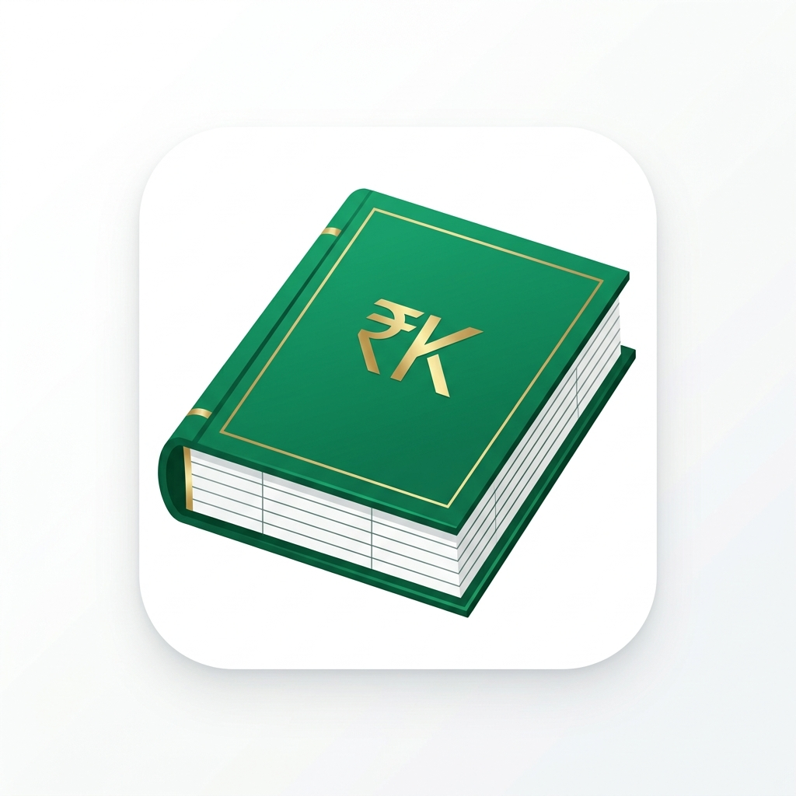

# Simple Khata — Offline Windows Desktop Accounting Application

A simple, fast, and reliable **offline Windows desktop customer khata & ledger accounting application** built for small businesses and daily shop use.



## Core Capabilities

1. **100% Offline & Local**:
   - Zero internet requirement.
   - All data saved locally in SQLite (`data/khata.db`).
   - ACID transactions, persistent constraints, and decimal-safe financial math (cents-level integer precision).

2. **Strict Dual-Currency Engine**:
   - Supports **ONLY AED** (UAE Dirham) and **PKR** (Pakistani Rupee).
   - Fixed per customer account.
   - Cross-currency mixing is strictly prevented.
   - Dashboard and reports display AED and PKR totals separately.

3. **Sequential Customer Account Codes**:
   - System auto-generates codes: `01`, `02`, `03` ... `99`, `100`, `101`, etc.
   - Immutable, unique, and preserved permanently (never reused even if an account is archived).

4. **Running Ledger & Balance Calculation**:
   - Balance formula: `Balance = Previous Balance + Debit (Given) - Credit (Received)`.
   - Clear status labels: `Receivable` (customer owes business), `Payable` (business owes customer), `Zero Balance`.
   - Automatic chronological running balance recalculation when any transaction is added, edited, or deleted.

5. **Customer Statements & Receipts**:
   - Printable A4 statement layout with business header, customer details, and summary calculations.
   - Payment receipts (`REC-000001`) with previous balance, amount received, and remaining balance.

6. **Backup & Disaster Recovery**:
   - One-click manual backup (`Khata_Backup_YYYY-MM-DD.db`).
   - Automatic backup scheduler (Daily, Every 3 Days, Weekly, Manual).
   - Safe restoration with pre-restore safety snapshots.

7. **Security & Audit Logs**:
   - Role-based permissions (Admin vs Staff).
   - Tamper-evident Audit Log recording every creation, edit, deletion, archive, and backup.

---

## Quick Start & Running

### Desktop Application Mode (Electron)
```powershell
npm start
```

### Local Web / Browser Mode
```powershell
npm run start:web
```
Then open `http://localhost:4567` in your browser.

---

## Keyboard Shortcuts for Fast Daily Shop Use

| Shortcut | Action |
| :--- | :--- |
| **`Ctrl + N`** | Open Quick New Transaction modal |
| **`Ctrl + F`** | Focus global customer/transaction search bar |
| **`Ctrl + S`** | Save transaction or customer in active modal |
| **`Esc`** | Cancel or close modal |

---

## Automated Verification Tests

### Daily-use improvements

- Administrators can edit entries from **All Transactions** or the customer's **Khata**. Customer and currency stay locked; amounts, dates, debit/credit, description, payment method, references and notes can be corrected. Balances and receipts update automatically.
- Transactions support customer, payment method, date, currency, debit/credit and minimum/maximum amount filters. The top search box also matches reference numbers. Amount filters use each account's currency, without converting or adding AED and PKR together.
- Balance labels explain **Aapko lena hai (Receivable)**, **Aapko dena hai (Payable)** and **Hisaab barabar (Settled)**.
- **Backup & Restore** shows the last successful backup, next due time and failures. Automatic backups check every minute while the app/server runs; missed backups run on next startup. The dashboard reminds you when a backup is due, missing or failed.
- **Settings → Security & Users → Change your password** requires your current password and matching new passwords of at least 8 characters.
- Closing an edited form, switching away from unsaved settings, signing out or closing/reloading the app warns before discarding changes.

Run the built-in test suites anytime:

```powershell
# Unit test for database layer, decimal precision, & currency isolation:
npm run test:db

# Full end-to-end integration test:
npm run test:e2e

# Accounting edge cases, receipt updates, validation and restore failure recovery:
npm run test:regressions

# Desktop UI actions and real Electron sidebar clicks:
npm run test:ui
npm run test:navigation
```

Database and API tests use separate temporary databases and backup folders. The desktop navigation test reads existing records into memory with disk writes disabled; UI action tests use mock data.

---

## Building Standalone Windows `.exe`

To generate a standalone Windows installer and portable `.exe`:

```powershell
npm run build:exe
```
The output executable will be placed in the `dist/` directory.

## Google Drive backup (Windows desktop)

Open **Backup & Restore → Google Drive backup → Connect Google Account**.
The Windows app includes its Desktop OAuth client configuration. Choose your
Google account in the browser; the connected email is shown in the app.
**Change Google Account** opens the chooser again. Changing accounts clears the
old cloud list and keeps queued snapshots locally so they are not sent to the new
account. Cancelling sign-in preserves the existing connection.

Advanced setup can import a different Desktop OAuth client. Existing imported
clients are preserved. Use the same Google project and OAuth client when restoring
on a replacement computer. User access and refresh tokens must never be included
in source or release files; the bundled native client configuration is not a user token.

The app requests only `https://www.googleapis.com/auth/drive.appdata`. Snapshots are
stored in private app storage and managed from the app rather than My Drive.
External OAuth apps in Testing have seven-day refresh tokens; review Google's
production requirements for ongoing use. Setup references:
https://developers.google.com/identity/protocols/oauth2/native-app
https://developers.google.com/workspace/drive/api/guides/appdata

Click **Back Up to Drive Now** to upload and verify the first snapshot. Subsequent
local backups use the existing backup schedule and are queued for Drive. While the
app is open, pending uploads retry every minute; queue files survive restart and
local backup pruning. Cloud copies are retained (no automatic remote deletion),
subject to the Google account's available storage. Individual cloud snapshots are
limited to 256 MB. Local backup continues independently of Google connectivity.

OAuth credentials and refresh tokens are protected by Electron safeStorage in the
Windows user's application-data directory, outside the database/backups. They do
not travel with a restored database. Backup database files themselves are not
application-encrypted; they rely on local OS and Google account access controls.
Disconnect removes local access and attempts token revocation; if offline, revoke
permissions later at your Google Account connections. Pending snapshots are kept
as local backups rather than uploaded to a subsequently connected account.

Restore verifies the downloaded checksum and database integrity/schema, then uses
the existing restore flow with a local pre-restore safety copy. Restore confirmation
is required in the UI. These controls follow the app's existing Admin role model.
Direct Google sign-in is desktop-only; web preview displays an explanatory message.

Validation: `npm run test:drive` covers offline retries, restart persistence,
lost-response deduplication, OAuth state/PKCE, restore integrity and disconnect.
`npm run test:drive-ui` uses temporary sample data and mocked Google responses.
Actual Google account connection and the first live upload must be checked after
credentials are configured; mocked tests do not demonstrate a live cloud backup.

## Security and verification (1.0.1)

Desktop IPC and the local web API resolve identities from backend-owned sessions.
Renderer/request user objects cannot grant permissions. Staff can view accounts,
add customers and transactions, and change their own password; account/history
editing, users, settings and backup management require an administrator.
Enable **Require Password Login on Startup** for access control on a shared PC.
Disabling it intentionally enables local single-user administrator mode.
Logout locks that session. Successful restore clears sessions and requires login;
password changes revoke other sessions. Existing SHA-256 passwords migrate to
unique salted scrypt hashes after successful login without changing passwords.

Restore validates SQLite integrity, schema, record references and an administrator
account before replacing data, and retains the existing pre-restore safety copy.
Customers and Transactions keep their controls visible and scroll within the list.

Additional checks:
- `npm run test:security`: forged identities, password migration and invalid restores.
- `npm run test:desktop`: the actual main process and IPC, using a temporary profile.
- `npm run test:e2e`: HTTP cookies, login/logout, staff access and restore invalidation.
- `npm run test:navigation`: real mouse clicks and populated lists at 1280x820 and 1024x700.
- `npm run test:ui`: current debit/credit fields, forms, exports and login controls.

The Windows package uses an explicit application-file list; working databases,
backups, test profiles and screenshots are excluded.

On Windows systems without symlink privileges, the optional executable-editing
helper can fail to extract. The unsigned fallback build used for this release is:
`npm run build:exe -- --config.win.signAndEditExecutable=false`.
This skips executable resource editing/signing; application window branding remains.
